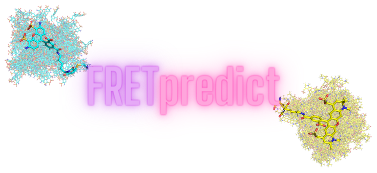

[](https://fretpredict.readthedocs.io/latest/?badge=latest)
[](https://doi.org/10.1101/2023.01.27.525885)
[](https://doi.org/10.5281/zenodo.10573638)
[](https://doi.org/10.5281/zenodo.10371378)

<br />
<p align="left">
  

Overview
--------

__[FRETpredict](https://doi.org/10.1038/s42003-024-05910-6)__ is a Python package based on the Rotamer Library Approach (RLA) for calculating FRET efficiency based on protein conformational ensembles and MD trajectories.

The FRETpredict class is initialized with (i) a protein structure or trajectory (provided as `MDAnalysis Universe` objects), (ii) the residue indices to which the fluorescent probes are attached, and (iii) the rotamer libraries for the fluorophores and linkers to be used in the calculation.

### FRETpredict algorithm

For each protein structure to be analysed — either individually or as an ensemble — the FRETpredict algorithm places the FRET probes at the selected protein sites independently of each other. Relative orientations and distances between the dyes are then computed for all combinations of the donor and acceptor rotamers. Further, nonbonded interaction energies between each rotamer and the surrounding protein atoms are calculated within a radius of 1.0 nm. Using these energies, statistical weights are first estimated for donor and acceptor rotamers independently and subsequently combined to calculate average FRET efficiencies. It is also possible to reweight frames and conformations based on protein-dye interactions to compute reweighted FRET efficiencies. This is particularly useful for Intrinsically Disordered Proteins, for which the effective fraction of the frames that contribute to averages is usually small.

In FRETpredict, the average FRET efficiency can be calculated in three different regimes: Static, Dynamic, and Dynamic+. We suggest using the _Dynamic_ regime when making predictions on protein trajectories and the _Static_ regime for single protein structures. Simply _averaging_ the results from the three regimes often leads to good agreement with experiments.


### Rotamer libraries
In FRETpredict, rotamer libraries are created through the following steps: (i) generation of the conformational ensemble of the FRET probe using MD simulations (to perform indipendently), (ii) selection of the peaks of the dihedral distributions of the linker, (iii) two clustering steps, and (iv) filtering. These steps are implemented in `FRETpredict/rotamer_libraries.py`. We recommend using _large_ rotamer libraries when the computational cost is not a limiting factor and _medium_ libraries for larger conformational ensembles.

The `lib/libraries.yml` file lists all the available Rotamer Libraries, along with necessary fluorophore information, including atom indices for calculating transition dipole moments and distances between fluorophores.

<!---
If you use the rotamer libraries for Cy3 C2R and Cy5 C2R, please cite [Walczewska-Szewc and Corry (2014)](https://doi.org/10.1039/C4CP01222D). 
- Lumiprobe Cy3 C2R (`C3N C2R`, `CY3 C2R` from __[HandyFRET](https://karri.anu.edu.au/handy/rl.html)__)
- Lumiprobe Cy5 C2R (`CY5 C2R` from __[HandyFRET](https://karri.anu.edu.au/handy/rl.html)__)
--->
If you use the rotamer libraries for Cy3b C2R and CF660R C2R, please cite [Klose et al. (2021)](https://doi.org/10.1016/j.bpj.2021.09.021). 

#### Currently available Rotamer Libraries
- AlexaFluor 350 C1R + L1R (`A35 C1R`, `A35 L1R`)
- AlexaFluor 488 C1R + L1R + B1R (`A48 C1R`, `A48 L1R`, `A48 B1R`)
- AlexaFluor 532 C1R + L1R (`A53 C1R`, `A53 L1R`)
- AlexaFluor 561 C1R + L1R (`A56 C1R`, `A56 L1R`)
- AlexaFluor 594 C1R + L1R (`A59 C1R`, `A59 L1R`)
- AlexaFluor 647 C2R + L1R (`A64 C2R`, `A64 L1R`)

- ATTO 390 C2R + L1R (`T39 C2R`, `T39 L1R`)
- ATTO 425 C2R + L1R (`T42 C2R`, `T42 L1R`)
- ATTO 465 C2R + L1R (`T46 C2R`, `T46 L1R`)
- ATTO 495 C2R + L1R (`T49 C2R`, `T49 L1R`)
- ATTO 520 C2R + L1R (`T52 C2R`, `T52 L1R`)
- ATTO 610 C2R + L1R (`T61 C2R`, `T61 L1R`)
- ATTO 488 C3R (`T48 C3R`)
- ATTO Thio12 C3R (`Tth C3R`)

- Lumiprobe Cy3b C2R (`Cy3b C2R` from __[MMM](https://github.com/gjeschke/MMM)__)
- Lumiprobe Cy5.5 C2R + L1R (`C55 C2R`, `C55 L1R`)
- Lumiprobe Cy7.5 L1R (`C75 L1R`)

- CF 660R C2R (`CF660 C2R` from __[MMM](https://github.com/gjeschke/MMM)__)

In the absence of the exact probes, accurate trends can be predicted by (i) choosing rotamer libraries with similar structural characteristics (linker length, linker dihedrals, fluorophore structure) and (ii) manually setting the $R_0$ for the experimental pair of dyes.

Installation
------------

To install FRETpredict, use the [PyPI package](https://pypi.org/project/FRETpredict):

```bash
  pip install FRETpredict
```

or clone the repo and install locally:

```bash
  git clone https://github.com/KULL-Centre/FRETpredict.git
  cd FRETpredict

  pip install -e . 
```

The software requires Python 3.6-3.9.

In case of dependency issues, consider installing FRETpredict in a new environment

```bash
  conda create -n myenv python=3.9 pip
  conda activate myenv
  pip install -e .
```

Testing
-------

```bash
  pip install pytest

  python -m pytest
```
The tests reproduce internal reference data for the following protein systems:
- Hsp90 from [MDA](https://www.singlemolecule.uni-freiburg.de/software/structure), [DOI: 10.1038/nmeth.4081](http://dx.doi.org/10.1038/nmeth.4081)

Code Example
------------

```python

import MDAnalysis
from FRETpredict import FRETpredict

# Create a MDAnalysis.Universe object for the protein structure.
u = MDAnalysis.Universe('tests/test_systems/pp11/pp11.pdb', 'tests/test_systems/pp11/pp11.xtc')

# Create instance of the FRETpredict class
FRET = FRETpredict(protein=u, residues=[0, 12], chains=['A', 'A'], temperature=298, 
                   donor='AlexaFluor 488', acceptor='AlexaFluor 594', electrostatic=True,
                   libname_1=f'AlexaFluor 488 C1R cutoff10',
                   libname_2=f'AlexaFluor 594 C1R cutoff10',  
                   output_prefix='E_pp11')

# Run FRET efficiency calculations.
FRET.run()

```
Compute reweighted FRET efficiency based on protein-dye interactions

```python

FRET.reweight(reweight_prefix='E_pp11_reweighted')

```
and combine user-provided weights from previous calculations (e.g., Enhanced sampling simulations)

```python

FRET.reweight(reweight_prefix='E_pp11_reweighted', user_weights=user_weights_pp11)

```

Further examples can be found at [github.com/KULL-Centre/_2023_Montepietra_FRET](https://github.com/KULL-Centre/_2023_Montepietra_FRET).

Tutorials
---------

- __[Tutorial_FRETpredict_pp11](https://github.com/Monte95/FRETpredict/blob/62ee39e82e82691a237da8e927d686378aff5fb1/tests/tutorials/Tutorial_FRETpredict_pp11.ipynb)__: Jupyter Notebook with simple tutorials on how to compute the FRET efficiency from the trajectory of a Poliproline 11 (pp11) system.

- __[Generate new rotamer libraries](https://github.com/Monte95/FRETpredict/blob/eef8bf0d219109ada605e943ecc4b1aa9dde86df/tests/tutorials/Tutorial_generate_new_rotamer_libraries.ipynb)__: Jupyter Notebook on how to create and add new rotamer libraries.


Structure
---------
```
FRETpredict/
├─ FRETpredict/
│  ├─ lib/
│  │  ├─ R0/
│  ├─ FRET.py
│  ├─ lennardjones.py
│  ├─ libraries.py
│  ├─ R0_calculation.py
│  ├─ rotamer_libraries.py
│  ├─ utils.py
│  ├─ __init__.py
├─ tests/
|  ├─ test_Hsp90.py
│  ├─ test_systems/
│  │  ├─ Hsp90/
│  │  ├─ pp11/
│  ├─ tutorials/
│  │  ├─ test/
│  │  |  ├─ genLIB/
│  │  ├─ Tutorial_FRETpredict_pp11.ipynb
│  │  ├─ Tutorial_generate_new_rotamer_libraries.ipynb
├─ LICENSE
├─ README.md
├─ setup.py
```

Contributors
-------------

[Daniele Montepietra (@Monte95)](https://github.com/Monte95)

[Giulio Tesei (@gitesei)](https://github.com/gitesei)

[João M Martins (@joaommartins)](https://github.com/joaommartins)

[Micha BA Kunze (@mbakunze)](https://github.com/mbakunze)

[Robert Best (@bestlab)](https://github.com/bestlab)

[Kresten Lindorff-Larsen (@lindorff-larsen)](https://github.com/lindorff-larsen)
